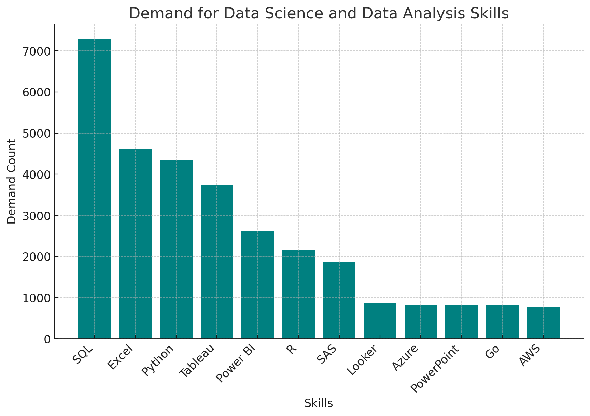

# Data Science and Data Analysis Jobs Market Analysis

This project involves analyzing a job market dataset using PostgreSQL, with a specific focus on data science and data analysis roles. The goal of this analysis is to uncover trends related to job demand, salary ranges, and other relevant metrics for these roles.

Analysis Objective
The primary objective of this analysis is to understand the current demand for data science and data analysis jobs, identify salary trends, and highlight key skills required in these roles. This information is crucial for professionals in the field, job seekers, and organizations aiming to attract top talent.

Data Processing
The analysis was conducted using PostgreSQL, where I employed SQL queries to extract, filter, and aggregate data related to job postings. Key metrics such as job demand, salary distribution, and required skills were analyzed to provide a comprehensive view of the data science and data analysis job market.

Here’s a concise addition to your GitHub README that incorporates the result set:

---

## Top Skills and Average Salaries

This project highlights some of the top in-demand technical skills in the job market, along with their corresponding average salaries. Mastery of these skills can lead to highly competitive compensation across various industries.

| Skill         | Average Salary ($) |
|---------------|--------------------|
| PySpark       | 208,172            |
| Bitbucket     | 189,155            |
| Watson        | 160,515            |
| Couchbase     | 160,515            |
| DataRobot     | 155,486            |
| GitLab        | 154,500            |
| Swift         | 153,750            |
| Jupyter       | 152,777            |
| Pandas        | 151,821            |
| Elasticsearch | 145,000            |

 *Key Insights*:
- **PySpark** leads the list with the highest average salary, reflecting its importance in big data processing.
- **Bitbucket**, a popular version control tool, also commands a high salary, emphasizing the value of collaboration tools in modern development workflows.
- **Watson** and **Couchbase** highlight the demand for AI and NoSQL database expertise, both with identical average salaries.
- **Pandas** and **Jupyter** are crucial for data analysis and scientific computing, showing their continued relevance in the data science space.

## Job Listings and Average Salaries

- **Highest Salary**: The role of *PAID Data Scientist Intern* in Sudan offers the highest salary of $40,000, posted by Patterned Learning AI.
- **Variety of Roles**: Positions range from *Data Analyst* to *Head of Data*, reflecting a broad spectrum of data-related job titles.
- **Global Opportunities**: These jobs are spread across countries like the United States, South Korea, Sudan, Malta, and Macedonia, with remote working options.
- **Job Types**: Most roles are full-time, with one notable contractor position for a *Data Analyst* in Malta.

## The following table provides an overview of high-paying data science roles, their required skills, and other relevant details:

| Job ID   | Job Title                               | Location    | Country        | Salary ($/Year) | Posted Date | Schedule   | Company Name        | Skills                             |
|----------|-----------------------------------------|-------------|----------------|-----------------|-------------|------------|---------------------|------------------------------------|
| 40145    | Staff Data Scientist/Quant Researcher   | Anywhere    | United States  | 550,000         | 2023-08-16  | Full-time  | Selby Jennings      | SQL, Python                        |
| 1714768  | Staff Data Scientist - Business Analytics | Anywhere    | United States  | 525,000         | 2023-09-01  | Full-time  | Selby Jennings      | SQL                                |
| 1131472  | Data Scientist                          | Anywhere    | United States  | 375,000         | 2023-07-31  | Full-time  | Algo Capital Group  | SQL, Python, Java, Cassandra, Spark, Hadoop, Tableau |

 *Key Insights*:
- **Highest Salaries**: The *Staff Data Scientist/Quant Researcher* and *Staff Data Scientist - Business Analytics* roles offer the highest annual salaries, reflecting their high demand and specialized nature.
- **Skills in Demand**: Common skills required include *SQL*, *Python*, and *Data Tools* like *Spark* and *Tableau*.
- **Consistent Role**: *Data Scientist* roles are prevalent, indicating a strong market demand for this position.
- **Full-Time Opportunities**: All positions are full-time, indicating stability in job scheduling.

